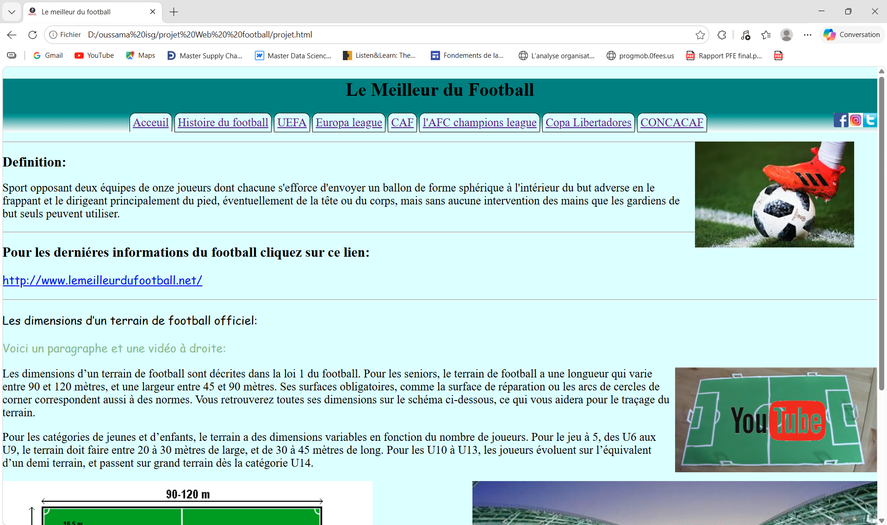
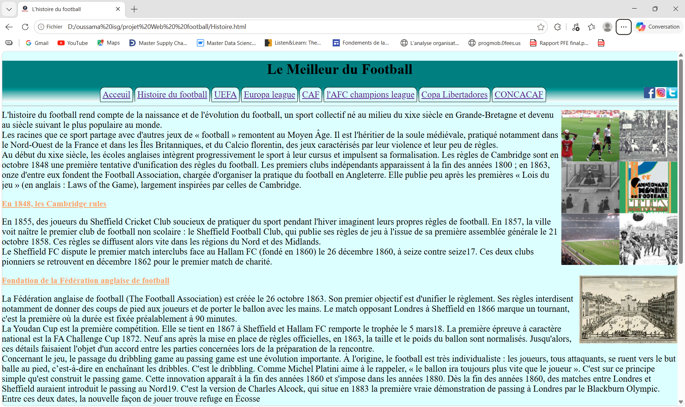
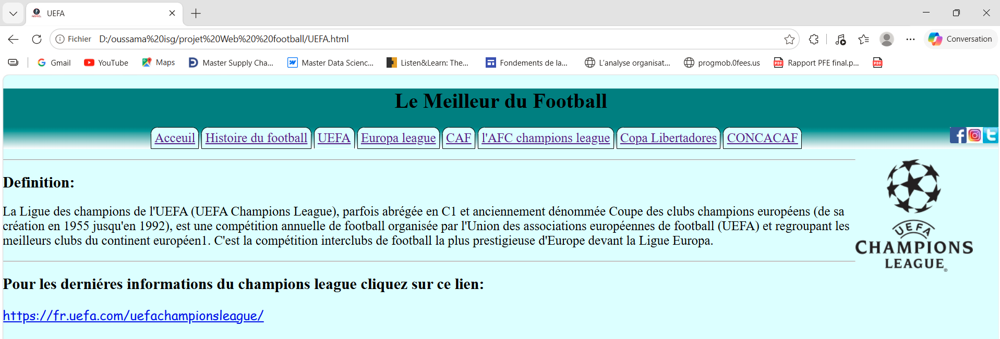
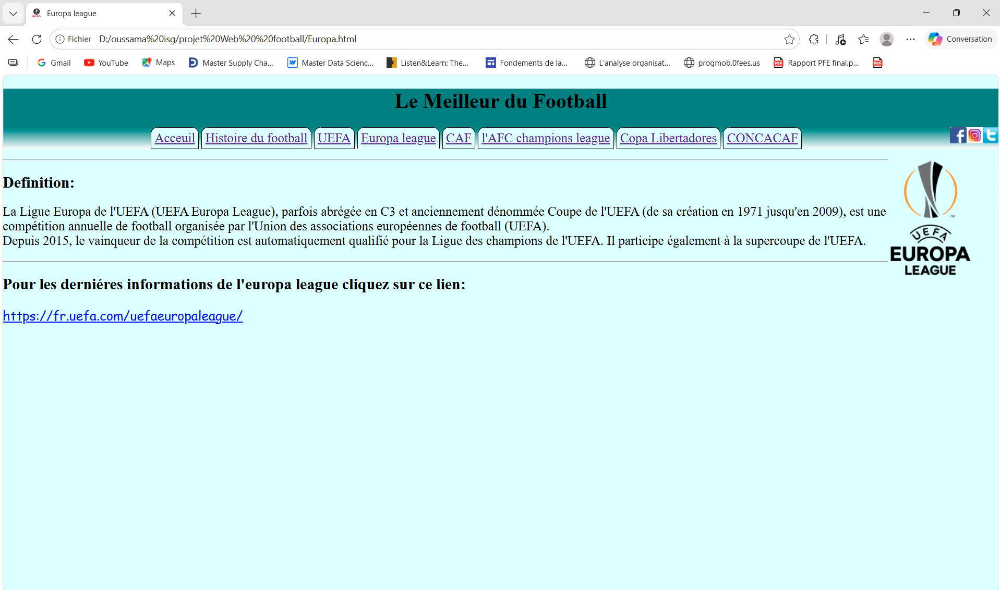
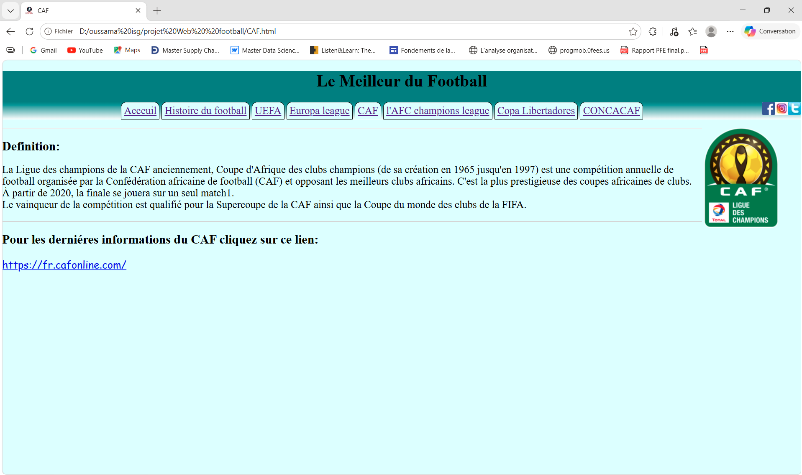
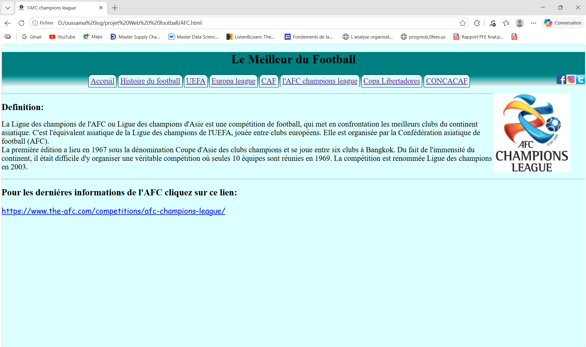
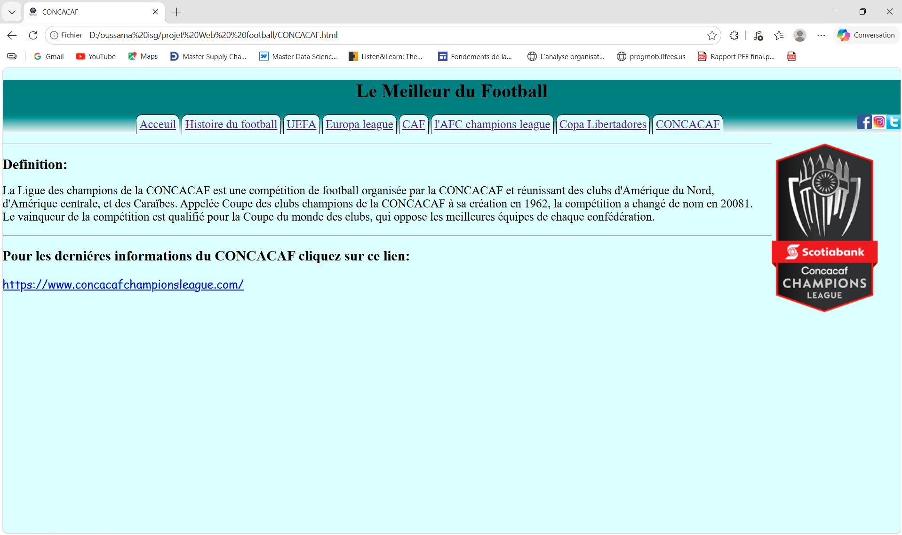
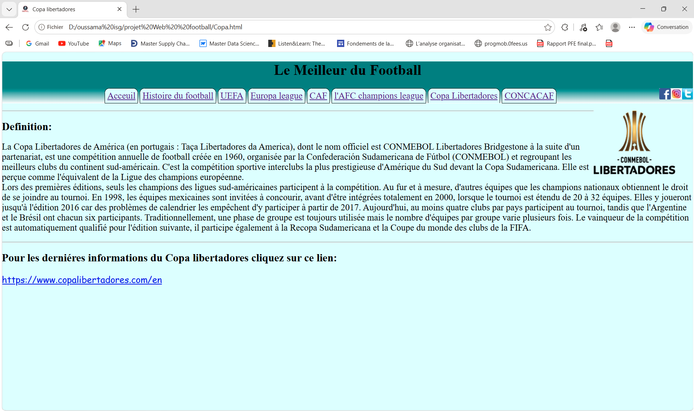

# ⚽ Football Cups & Competitions Website

A front-end web project dedicated to football, presenting major international and continental competitions along with football history, field dimensions, and useful football-related resources.

---

## 📌 Project Overview

This project is a static website developed with **HTML and CSS** to provide information about major football competitions around the world.

The website presents different continental tournaments and includes dedicated pages for each competition.

---

## 🏆 Featured Competitions

The website covers several major football competitions:

* 🇪🇺 **UEFA Champions League**
* 🇪🇺 **UEFA Europa League**
* 🌍 **CAF Champions League**
* 🌏 **AFC Champions League**
* 🇸🇦 **Copa Libertadores**
* 🌎 **CONCACAF Competitions**

---

## 📖 Website Sections

### 🏠 Home

Introduction to football, its definition, and useful football resources.

### 📚 History of Football

Information about the history and development of football.

### 🏆 Football Competitions

Dedicated pages covering major continental competitions:

* UEFA
* Europa League
* CAF
* AFC Champions League
* Copa Libertadores
* CONCACAF

### ⚽ Football Field

Information about official football field dimensions, including differences between senior and youth categories.

### 🌐 Social Media

Links to football-related social media pages on:

* Twitter / X
* Instagram
* Facebook

---
## 📸 Application Pages

### 🏠 Home Page



### ⚽ Football History



### 🏆 UEFA Champions League



### 🏆 UEFA Europa League



### 🌍 CAF Champions League



### 🌏 AFC Champions League



### 🌎 CONCACAF Champions League



### 🏆 Copa Libertadores



---


## 🛠️ Technologies Used

* **HTML5**
* **CSS3**
* **Images & Multimedia**
* **HTML Navigation & Links**

---

## 📂 Project Structure

```text
Football-Cups-Competitions/
│
├── HTML_PAGES
│   ├── index.html
│   ├── Histoire.html
│   ├── UEFA.html
│   ├── Europa.html
│   ├── CAF.html
│   ├── AFC.html
│   ├── Copa.html
│   ├── CONCACAF.html
│
├── projet.css
├── Principal.css
│
├── images/
│   ├── pages/
│       ├── page_acceuil.png
│       ├── page_histoire_football.png
│       ├── page_AFC.png
│       ├── page_CAF.png
│       ├── page_CONCACAF.png
│       ├── page_Europa_league.png
│       ├── page_UEFA.png
│       ├── page_copa_libertadors.png
│   ├── logo1.jpg
│   ├── foot.jpg
│   ├── twitter.jpg
│   ├── instagram.jpg
│   ├── facebook.png
│   ├── terrain.png
│   ├── terrain.jpg
│   └── video.png
│
└── README.md
```

> The exact file structure may vary depending on the organization of the project.

---

## 🚀 How to Run

No installation or backend is required.

1. Clone the repository:

```bash
git clone https://github.com/YOUR_USERNAME/Football-Cups-Competitions.git
```

2. Open the project folder.

3. Open `index.html` in your web browser.

---

## 🎯 Project Objectives

The main objectives of this project are to:

* Practice **HTML5 and CSS3**
* Build a multi-page website
* Implement navigation between web pages
* Present structured football information
* Work with images, links, and multimedia content
* Create a simple and accessible football-themed interface

---

## 📸 Content

The website includes football-related images, competition information, social media links, and a video related to football field dimensions.

---


## 📄 License

This project was developed for **educational purposes**.
